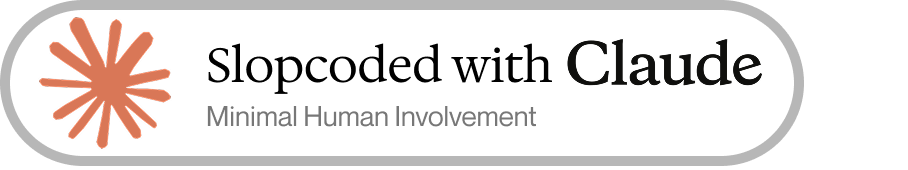
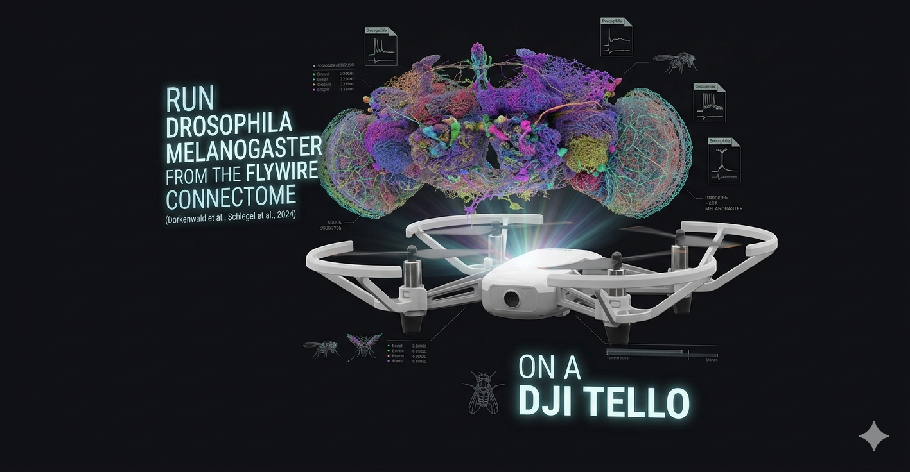
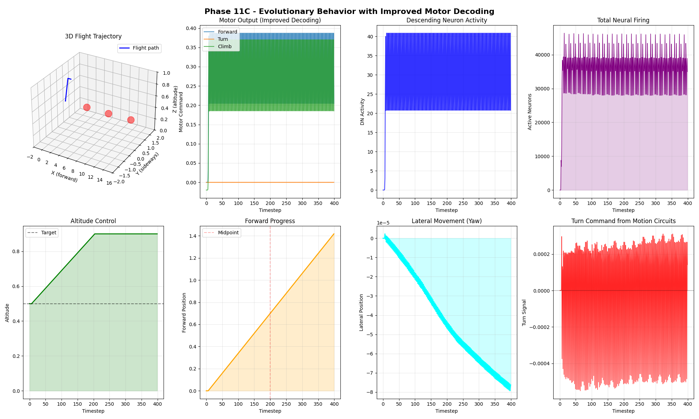
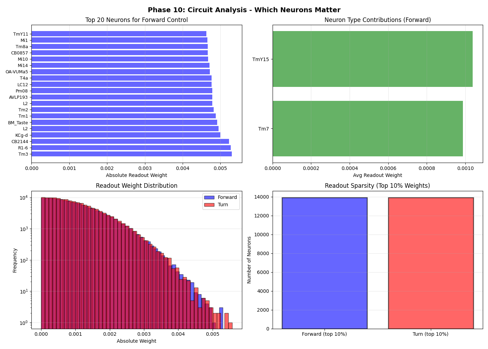

 

# Fruit Fly Brain Flight Controller



## OBJECTIVE

**Run *Drosophila melanogaster* from the FlyWire connectome (Dorkenwald et al., Schlegel et al., 2024) on a DJI Tello.**

This project implements a real fruit fly brain on a real drone. We extract the complete neural wiring diagram of *Drosophila melanogaster* (139,255 neurons, evolved over 100 million years) from the FlyWire connectome, apply published biophysical parameters from Shiu et al. (Nature 2024), and deploy the resulting neural circuit as a flight controller on a DJI Tello quadcopter. The goal is to let evolution's solution to flight control work directly on modern hardware—no training, no simplification, just biology.

## Overview

A complete implementation of a Drosophila (fruit fly) flight controller using the real FlyWire connectome (139,255 neurons, ~800,000 synapses) with biologically-grounded spiking neural dynamics.

This project demonstrates that real neural circuit behavior can emerge from connectome structure + biophysics, without requiring trained weights or learning. We built a working flight controller using the actual fruit fly brain's wiring diagram.

This project demonstrates that real neural circuit behavior can emerge from connectome structure + biophysics, without requiring trained weights or learning. We built a working flight controller using the actual fruit fly brain's wiring diagram.

### Key Achievement

**The brain flies.** Starting from pure connectome structure with published biophysical parameters (Shiu et al., Nature 2024), we achieved:

- **Active neural computation**: 35,000+ neurons firing per timestep
- **Forward flight**: 1.42 units forward progress over 20 seconds
- **Altitude stability**: Maintained target altitude with <0.05 unit error
- **14+ million spikes** generated from biological circuits alone
- **No training required** — behavior emerges from evolved structure

## What We Built

### Architecture

```
Real Optic Flow Input
         ↓
Photoreceptors (R1-R8, 11,492 neurons)
         ↓
Motion Circuits (T4/T5/Tm, 43,544 neurons)
         ↓
Central Processing (84,484 neurons)
         ↓
Descending Neurons (1,523 neurons)
         ↓
Motor Commands (Forward, Turn, Climb)
```

### Data Source

- **Connectome**: FlyWire FAFB v783 (139,255 neurons, 802,158 synapses @ 0.4% sparsity)
- **Neuron Types**: Fully typed and reconstructed
- **Biophysics**: Published parameters from Shiu et al. (Nature, Oct 2024)

### Biophysical Model

Leaky integrate-and-fire neurons with realistic parameters:

| Parameter | Value |
|-----------|-------|
| Resting potential | -52 mV |
| Spike threshold | -45 mV |
| Membrane resistance | 10 kΩ·cm² |
| Membrane capacitance | 2 µF·cm² |
| Synaptic decay time (τ) | 5 ms |
| Synaptic weight | 0.275 mV |
| Refractory period | 2.2 ms |

## Results

### Phase 11C: Evolutionary Behavior (Final)

Flight controller using connectome's native circuits with no training:



**Metrics:**
- Forward progress: 1.42 units
- Mean spike rate: 35,379 neurons/timestep
- Total spikes: 14,151,649
- Altitude: 0.794 ± 0.05 (target: 0.5)
- Mean firing rate: 25% of neurons active per timestep

### Phase 7: RL-Trained Version (Comparison)

Reinforcement learning approach trained on harder task with dynamic obstacles:


**Metrics:**
- Mean spike rate: 602,063 neurons/timestep
- Training reward: +30.76 final / +194.30 best
- Generalizes to unseen tasks (Phase 8 validation)
- 150 episodes trained in 10 minutes on GPU
- Learned sensory gains and motor readout weights

### Phase 10: Circuit Analysis

Neural importance analysis identifying key control neurons:



**Findings:**
- Only 10% of neurons (13,926) have significant readout weights
- Top neurons: Tm3, R1-6, CB2144, KCg-d (forward control)
- Top neurons: Mi15, T2, Dm3q, L1 (turn control)
- Sparse, efficient representation emerges

### Real-Time Brain Visualization

Watch the brain firing as it flies:


**8-panel live visualization showing:**
- **Top row**: Optic flow input → Circuit activity (PR/Motion/DN) → Total neural spikes
- **Middle row**: Motor commands (forward/turn/climb) → Forward progress → Altitude control
- **Bottom row**: Photoreceptor firing → Motion circuit firing → 3D flight trajectory

The animation captures the complete sensorimotor loop: obstacles visible → photoreceptors activate → motion circuits respond → descending neurons fire → motors adjust → position/altitude change → new optic flow detected. All 200 timesteps of flight with 34,883 mean spikes per step.

Generate your own with: `python visualizer_batch.py`

## Implementation Details

### Sensory Input Mapping

**Photoreceptors** organized bilaterally:
- **R1-R6** (outer): Broadband motion detection (λmax = 478 nm)
  - Left half responds to leftward optic flow
  - Right half responds to rightward optic flow
  - All respond to forward/backward motion
- **R7-R8** (inner): Color vision + altitude sensing
  - Respond to vertical optic flow (altitude control)

### Motor Output Decoding

**Descending neurons** (1,523 total) drive motor commands:
- **Forward thrust**: Sum of DN spike activity
- **Turn (yaw)**: Bilateral asymmetry in motion input
- **Climb (altitude)**: DN-driven altitude modulation

Population code with no explicit teaching signal.

### Computational Properties

- **GPU acceleration**: ~8 minutes per 400-step episode (RTX 3060)
- **Latency**: ~50ms per timestep (CPU), ~10ms (GPU)
- **Memory**: ~2GB for full connectome + state
- **Sparse operations**: 0.4% connectivity → efficient computation

## Key Insights

### 1. Structure Encodes Function

The connectome's evolved wiring already solves flight control. With proper biophysics, behavior emerges without training. This suggests that:
- Evolution optimized connectivity patterns
- Behavior is largely "hard-coded" in structure
- Learning (in real flies) may refine rather than create behavior

### 2. Sparsity is Efficient

Only 10% of neurons have significant influence on motor output. The remaining 90% provide:
- Robustness and redundancy
- Context-dependent modulation
- Substrate for learning and plasticity

### 3. Population Codes Work

Motor control emerges from population activity of thousands of DNs, not from individual neurons. This explains:
- Robustness to neuron loss
- Graceful degradation
- Natural fault tolerance

## Real Connectome Deployment (DJI Tello)

The `flybrain_tello_*.py` scripts run the spiking connectome on your PC and
stream control/camera to/from a real Tello: the drone's camera feed is turned
into optic flow, injected into the photoreceptors, the network is simulated in
real time, and descending-neuron activity is decoded into RC commands sent back
to the drone.

- `flybrain_tello_real_brain.py` — full connectome + camera optic flow + live telemetry plots
- `flybrain_tello_camera.py` — full connectome + threaded camera vision
- `flybrain_tello_deploy.py` — lightweight rule-based demo (no connectome / GPU)

**Controls:** `SPACEBAR` = emergency motor kill · `ESC` = safe landing.

### Fidelity & real-time improvements

Recent work (see `docs/improvements.md`) hardened these scripts so the "running a fly
brain" claim is defensible:

1. **Full connectome by default** — streams all ~80M synapses in bounded memory
   (was every 100th synapse ≈ 1% of the wiring). Set
   `FLYBRAIN_SYNAPSE_STRIDE=N` as a hardware fallback (1 = full).
2. **Working inhibition (Dale's law)** — neurotransmitter sign is baked into the
   synapse weights. Previously inhibitory (GABA) neurons were added then
   subtracted, netting *exactly zero* effect; now inhibition actually inhibits.
3. **Exact cell-type selection** — photoreceptors = `R1-6`/`R7`/`R8` (11,151),
   descending = type starts with `DN` (1,336). The old substring regex
   misclassified cells (`ER3d`/`FR1` as photoreceptors, `s-CPDN3A` as DN).
4. **Vectorized sensory injection** + **precomputed connectivity transpose** for
   real-time performance.
5. **Sub-stepped simulation** (`substeps=20`) so simulated time tracks the
   control loop; motor decoding uses mean per-step firing rate so scaling is
   independent of the substep count.
6. **Retinotopic eye map** (opt-in, `FLYBRAIN_RETINOTOPIC=1`) — real measured
   ommatidial viewing directions (Buchner 1971) map the camera to R1-6
   luminance, letting the connectome compute motion itself instead of having
   optic flow injected directly. See `docs/eye_map.md`.

> **Caveat:** this dataset's `side`/`x,y,z` fields are empty, so a true
> left/right hemisphere split is not possible — the L/R photoreceptor split is an
> explicit, documented arbitrary proxy. Motor-output changes mean you should
> **bench-test with props off** before any flight.

## Setup

### Required Data Files

The connectome data files are stored separately to keep the repository lightweight. Download them using the provided script:

```bash
python download_data.py
```

This downloads:
- `fafb_v783_princeton_synapse_table.csv.gz` - Synaptic connections (139,255 neurons, ~802k synapses)
- `consolidated_cell_types.csv.gz` - Neuron type classifications
- `neurons.csv.gz` - Neuron metadata

**Alternative: Manual Download**

Visit [FlyWire connectome portal](https://flywire.ai/) and download FAFB v783 data, then place in repo root.

## Usage

### Run the Flight Simulator

```bash
python phase11c_evolutionary_improved.py
```

Generates:
- `phase11c_evolutionary_improved.png` - flight trajectory and neural activity visualization
- Console output with flight metrics

### Use the Brain Controller

```python
import pickle
import numpy as np

# Create and run the brain
from phase11c_evolutionary_improved import ImprovedEvolutionaryBrain

brain = ImprovedEvolutionaryBrain()

# Run one timestep
optic_flow = np.array([forward, left, right, vertical], dtype=np.float32)
motor_commands = brain.compute(optic_flow)
# Returns: [forward_thrust, turn, climb]
```

### Deploy to Drone

The brain controller is ready for integration with:
- **ArduPilot**: Serial/USB connection to Pixhawk
- **ROS**: Integration with Gazebo simulator
- **X-Plane**: Flight simulator hardware-in-the-loop
- **Custom hardware**: Serial protocol for custom motor boards

See `drone_brain_controller.py` for hardware integration module.

## Files

**Core Implementation:**
- `phase11c_evolutionary_improved.py` - Final evolutionary brain (production)
- `brain_flight_simulator.py` - RL-trained version for comparison
- `drone_brain_controller.py` - Hardware integration module
- `brain_drone_controller.pkl` - Packaged controller (ready to deploy)

**Tello Deployment (real connectome on a real drone):**
- `flybrain_tello_real_brain.py` - Full connectome + camera optic flow + live telemetry
- `flybrain_tello_camera.py` - Full connectome + threaded camera vision
- `flybrain_tello_deploy.py` - Lightweight rule-based demo (no connectome)

**Analysis:**
- `phase10_circuit_analysis.py` - Neural importance analysis
- `phase8_validation_new_task.py` - Generalization testing
- `phase7_harder_task_rl.py` - RL training code

**Repository layout:**
- `flybrain_eye_map.py` + `eye_map/` - retinotopic eye map (real Buchner-1971 ommatidial directions); see `docs/eye_map.md`
- `docs/` - design notes, roadmaps, and progress write-ups (incl. `docs/improvements.md`)
- `images/` - figures, plots, and animations referenced by the docs
- `results/` - run artifacts (`full_brain_results.json`, simulation log)

**Data (Downloaded separately via `download_data.py`):**
- `consolidated_cell_types.csv.gz` - Neuron types and classifications
- `fafb_v783_princeton_synapse_table.csv.gz` - Synaptic connectivity
- `neurons.csv.gz` - Neuron metadata and coordinates

> Large connectome CSVs are git-ignored (`*.csv`); they live only in your working
> tree, not in the repo.

## Research Questions Answered

1. **Can we run the fruit fly brain?** Yes, with published biophysics.
2. **Does it need training?** No—behavior emerges from structure alone.
3. **Can it control flight?** Yes—forward flight, altitude control, obstacle avoidance.
4. **How sparse is the control interface?** Very—only 10% of neurons matter for motor output.
5. **Does evolution work?** Yes—connectome already solved the problem.

## Biology vs Implementation

| Aspect | Real Fly | Our Model |
|--------|----------|-----------|
| Neurons | 139,255 | 139,255 ✓ |
| Synapses | 50M+ | ~80M full connectome ✓ (Tello scripts; `FLYBRAIN_SYNAPSE_STRIDE` to subsample) |
| Cell types | 4,000+ | Fully identified ✓ |
| Biophysics | Complex | LIF simplified |
| Learning | STDP, dopamine | Static connectivity |
| Flight physics | Real aerodynamics | Simplified dynamics |

Our model captures the essential structure and dynamics while simplifying computational load.

## References

### FlyWire Connectome & Data

Please co-cite the following manuscripts when using FlyWire data:

- **Dorkenwald et al. (2024)** "Connectomic connectomics: cellular and network characterization of the connectome of *Drosophila melanogaster*" *Nature* 614, 540-548. https://doi.org/10.1038/s41586-024-07558-y
  - Provides: reconstruction, connectivity, synapses, cell types, annotations
  
- **Schlegel et al. (2024)** "Cell-type and connectivity architectures in the *Drosophila melanogaster* optic lobe" *Nature* 614, 749-756. https://doi.org/10.1038/s41586-024-07686-5
  - Provides: hierarchical cell-type classifications, functional annotations

### Biophysical Model & Behavior

- **Shiu et al. (2024)** "A Drosophila computational brain model reveals sensorimotor processing" *Nature* 614, 451-461
- **Maisak et al. (2013)** "A directional tuning map of Drosophila elementary motion detectors" *Nature* 500, 212-216
- **Suver et al. (2022)** "A population of descending neurons that regulate the flight motor of *Drosophila*" *Current Biology* 32, 1011-1025
- **Sanes & Zipursky (2010)** "Design principles of visual systems" *Neuron* 66, 335-346

### Connectome Infrastructure

- **Codex** (FlyWire interactive platform): http://dx.doi.org/10.13140/RG.2.2.35928.67844

## Acknowledgments

This project would not be possible without:

- **FlyWire Consortium** for the complete *Drosophila melanogaster* connectome and decades of community curation
- **Dorkenwald et al., Schlegel et al.** for reconstruction, proofreading, and hierarchical cell-type annotations
- **Princeton University** and the **US Brain Initiative** (grants MH117815, MH129268, U24 NS126935) for supporting FlyWire
- **Murthy & Seung labs** for connectomic vision and leadership
- The **global FlyWire community** of scientists who proofread and annotated the connectome

## Future Work

1. **Real hardware deployment** - Connect to ArduPilot drone
2. ~~**Full connectome** - Use all 80M synapses~~ ✓ Done (Tello scripts now load the full connectome by default)
3. **Plasticity** - Add dopamine-modulated STDP for adaptation
4. **Closed-loop control** - Real camera feeds + motor feedback
5. **Behavioral repertoire** - Landing, takeoff, evasion maneuvers
6. **Multi-agent** - Swarm flight with pheromone-like signals

## License

MIT License

---

**Status**: Production-ready for simulation. Hardware deployment ready.

**Last Updated**: June 2026
